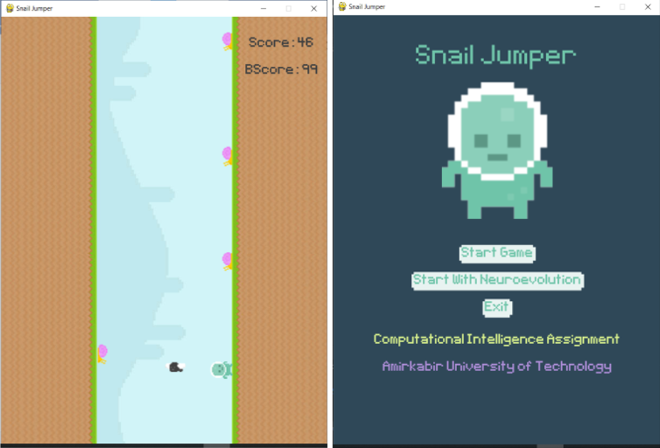

# Snail Jumper 

**Neuroevolution platformer game**  
**Computer Intelligence / Computational Intelligence – Fall 2021**  
**Amirkabir University of Technology**

Snail Jumper is a small 2D game built with `pygame` where a player character avoids falling obstacles (snails and flies). The project was designed as a course assignment to demonstrate **neuroevolution**: evolving neural-network‑controlled agents that learn to play the game automatically.

## Features

- **Two modes of play**
  - **Manual**: Control a single player yourself.
  - **Neuroevolution**: A population of agents controlled by neural networks that evolve over generations.
- **Evolutionary algorithm**
  - Fitness based on survival time / score.
  - Selection and reproduction to generate new populations.
- **Simple, self‑contained Python code**
  - No external backend or services required.
  - Uses local image and font assets.

## Project Structure

- `game.py` – Main game loop, menus, rendering, and event handling.
- `evolution.py` – Evolutionary algorithm for generating and updating populations.
- `nn.py` – Neural network implementation used by evolved agents.
- `player.py` – Player sprite, movement logic, controls / AI hook.
- `variables.py` – Shared configuration and global variables (screen size, title, etc.).
- `LearningCurve.py` – Script for analysing / plotting the learning curve over generations.
- `Plotting.py` – Helper plotting utilities (e.g., using `matplotlib`).
- `Graphics/` – All game art assets (background, player, snail, fly).
- `Font/PixelType.ttf` – Bitmap font used for in‑game text.
- `result_file.csv` – Example output data file with results from evolution runs.
